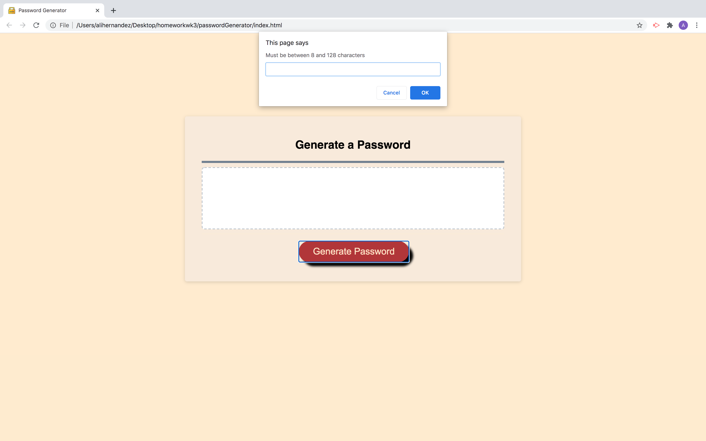
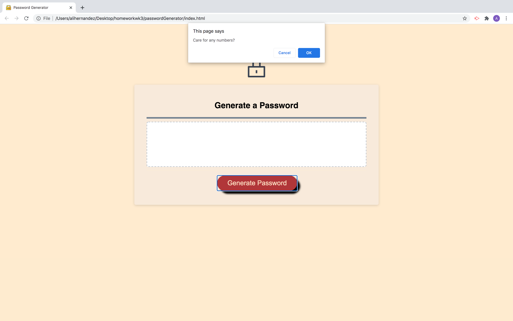
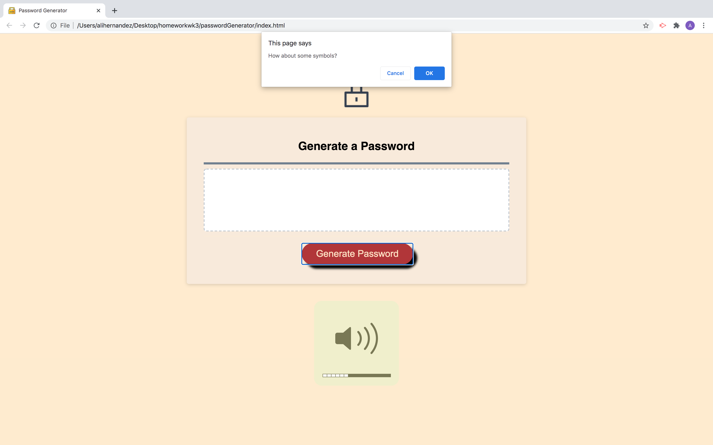
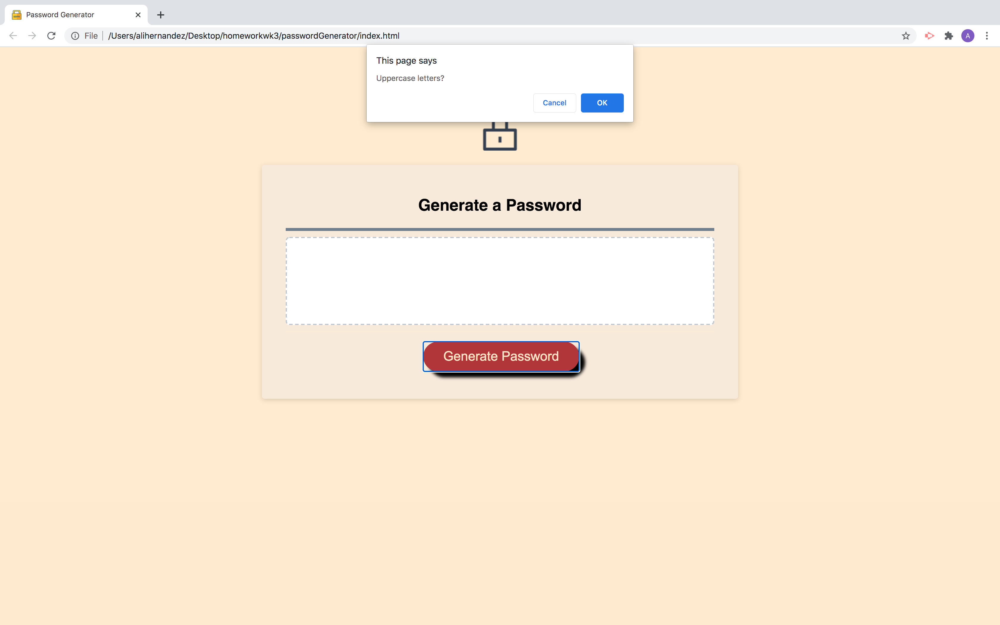
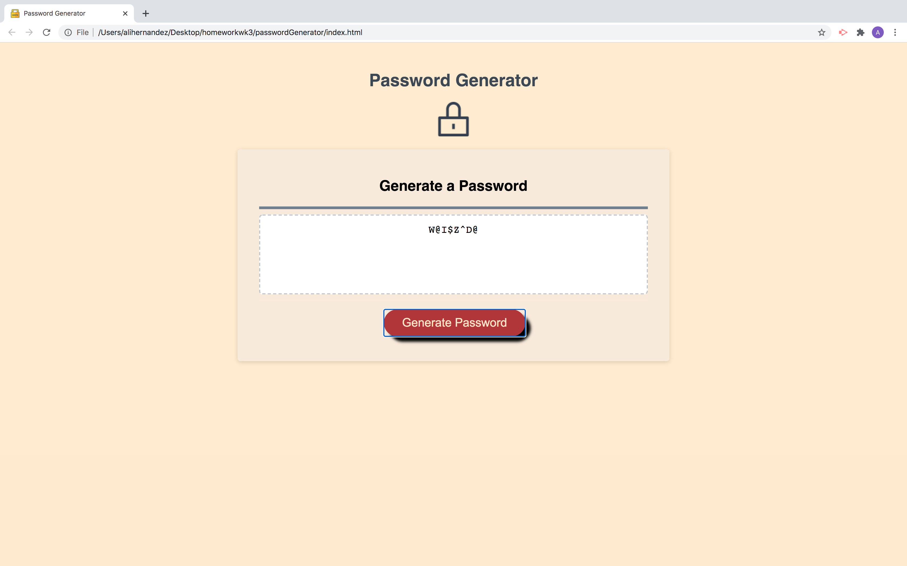

# passwordGenerator
Week 3 homework

Using functions, for loops, if/else statments generate random passwords based on user input.

##### ask how many letters the user would like between 8-128

##### ask if user wants any numbers in password

##### ask if user wants any symbols in password

##### ask if user wants any uppercase letters in password

##### ask if user wants any lowercase letters in password

##### print result in box.

[**finished**product] (https://alihernandez.github.io/passwordGenerator/)

