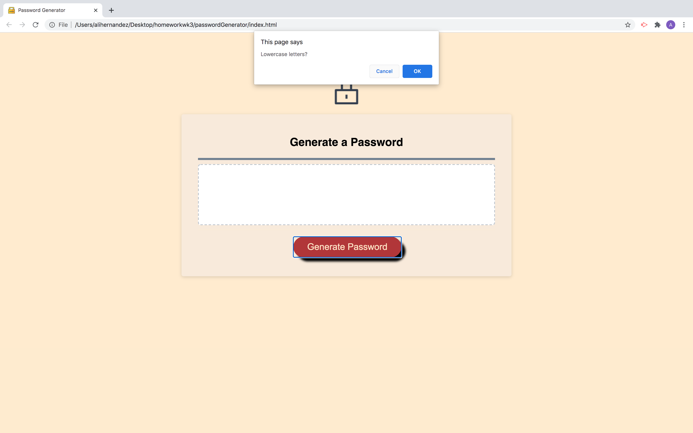

# passwordGenerator
Week 3 homework

Generates random passwords based on user input

# ask how many letters the would like between 8-128

# ask if user wants any numbers in password

# ask if user wants any symbols in password

# ask if user wants any uppercase letters in password

# ask if user wants any lowercase letters in password

